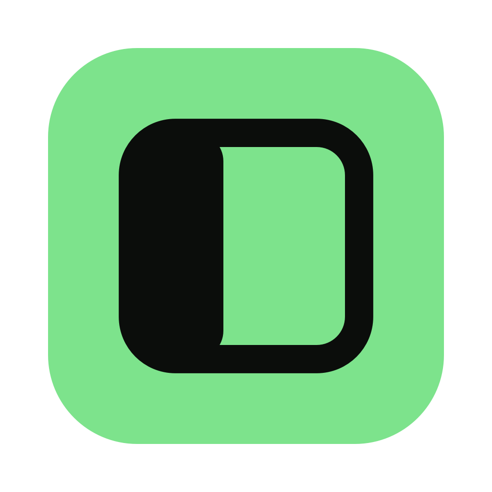

<p align="center">
  
</p>

<p align="center"><em>vibe coded in pty.party</em></p>

<h1 align="center">pty.party</h1>

<p align="center">
  <a href="https://github.com/fatherjake/pty.party/releases/latest/download/pty.party.zip">
    
  </a>
  &nbsp;
  <a href="https://github.com/fatherjake/pty.party/releases/latest">
    
  </a>
</p>

An infinite, zoomable canvas for macOS where AI coding agents and terminals live
as tiles you can wire together. Drop a **Claude Code** or **Codex** session onto
the canvas next to the images, notes, logs and other terminals it should know
about — then connect them with a drag, and the agent can see what you've linked.

pty.party ships with a small [Model Context Protocol](https://modelcontextprotocol.io)
server so the agents running inside it can read the canvas: look at the image
you've selected, pull in connected notes, watch a sibling terminal's output, and
keep a live checklist on a shared Log card as they work.

> **Platform:** macOS 13 (Ventura) or later. Built with Swift / SwiftPM and
> [SwiftTerm](https://github.com/migueldeicaza/SwiftTerm).

---

## What's in the box

The canvas holds several kinds of tile:

| Tile | What it is |
| --- | --- |
| **Claude** | A terminal running the `claude` CLI, with a session pinned so it can be resumed. |
| **Codex** | A terminal running the `codex` CLI. |
| **Terminal** | A plain login-shell terminal. |
| **Command Runner** | A compact widget that runs a configured command on demand or on a loop, with an expandable output log. |
| **Log** | An "Activity Log" card that renders a Markdown checklist. Connect terminals to it and agents can push/tick items live. |
| **Note** | A sticky note rendered as Markdown. |
| **Image** | Any image pasted, dropped, or sent onto the canvas. |

Tiles are **connected** by dragging from a tile's edge port (or an image's
corner handle) onto another tile. Connections are what the MCP server reads:
the images/notes/terminals/logs wired to a given terminal are exactly what that
terminal's agent can query.

Your layout is saved per **session** — each session keeps its own canvas
snapshot, images, and working folder, and the app restores the last one on
launch.

---

## Prerequisites

Before you build or run pty.party, make sure you have:

| Requirement | Why | Notes |
| --- | --- | --- |
| **macOS 13 (Ventura) or later** | Platform target of the app. | Hard requirement. |
| **Swift toolchain / SwiftPM** | Builds the app (`swift build`, `install.sh`). | Ships with Xcode or the Swift command-line tools. |
| **Node.js + npm** | Runs the MCP server that lets agents read the canvas. | Only needed if you want the MCP integration (recommended). |
| **`claude` CLI** | Powers **Claude** tiles. | Optional — install if you use Claude tiles. |
| **`codex` CLI** | Powers **Codex** tiles. | Optional — install if you use Codex tiles. |

The agent CLIs are looked up on your `PATH` and in the usual install locations
(`~/.local/bin`, `/opt/homebrew/bin`, `/usr/local/bin`) — install whichever
agents you plan to use. Plain **Terminal** and **Command Runner** tiles just use
your login shell, so they need none of the above. The **SwiftTerm** dependency
is fetched automatically by SwiftPM during the build; no manual install needed.

---

## Install

### 1. Build and install the app

```bash
git clone <this-repo> pty.party
cd pty.party
./install.sh            # builds release and installs to ~/Applications/pty.party.app
open ~/Applications/pty.party.app
```

`install.sh` runs `swift build`, assembles a proper `.app` bundle (icon +
`Info.plist`), and ad-hoc codesigns it. Pass `debug` for a debug build:
`./install.sh debug`.

To build without installing:

```bash
swift build -c release
swift run ptyparty          # run straight from the build
```

The Claude and Codex tiles shell out to the `claude` and `codex` CLIs. pty.party
looks for them on your `PATH` and in the usual install locations
(`~/.local/bin`, `/opt/homebrew/bin`, `/usr/local/bin`); install whichever
agents you want to use first.

### 2. Set up the MCP server (optional but recommended)

This is what lets the agents see the canvas. Install its dependencies:

```bash
cd mcp-server
npm install
```

Then register it with your agent so every session launched inside a pty.party
terminal can reach it. For Claude Code:

```bash
claude mcp add --scope user ptyparty -- node /absolute/path/to/pty.party/mcp-server/index.js
```

For Codex (`~/.codex/config.toml`):

```toml
[mcp_servers.ptyparty]
command = "node"
args = ["/absolute/path/to/pty.party/mcp-server/index.js"]
```

The server discovers which terminal it's running in via the
`PTYPARTY_TERMINAL_ID` environment variable that pty.party injects into every
terminal it spawns, so connection-aware tools "just work" inside the app.

### 3. Set up a project (Welcome card)

On first launch a **Welcome card** appears on the canvas listing these
requirements with a **Set up this project…** button. Clicking it installs the
`ptyparty` skill into your project's `skills` folder (it'll ask where if there
isn't one), drops a [`PARTY.md`](PARTY.md) working agreement at the project
root, prepends a line to your `AGENTS.md`/`CLAUDE.md` pointing agents at it, and
adds **Claude Code hooks** to `.claude/settings.json` so each tile shows live
status — blue while working, amber when it needs you, idle when done. Claude
Code will ask once to trust the new hooks. You can reopen the card any time from
**File → Set Up Project…**.

> The hooks report state by writing `PTYPARTY_TERMINAL_ID`-keyed files under
> `~/Library/Application Support/ptyparty/activity/`, which the app watches.
> They're guarded so they no-op outside pty.party. Terminals without them (Codex,
> plain shells, un-set-up projects) fall back to inferring status from output.

---

## MCP tools

Once registered, agents get these tools (server name `ptyparty`):

| Tool | Purpose |
| --- | --- |
| `get_selected_image` | The image currently selected on the canvas. |
| `get_connected_images` | Images wired to this terminal. |
| `get_connected_notes` | Notes wired to this terminal (as Markdown). |
| `get_connected_terminal_output` | Recent output of terminals connected to this one. |
| `add_image_to_canvas` | Place an image (path or base64) on the canvas. |
| `add_note_to_canvas` | Pin a titled Markdown checklist card. |
| `add_to_checklist` | Append items to the connected Log card(s). |
| `check_off_item` | Tick a Log item done by its text. |

The app and the MCP server communicate over a small file RPC under
`~/Library/Application Support/ptyparty/` (an `inbox/` for new tiles,
`connections/` for what's wired to each terminal, and `requests/`+`responses/`
for live queries). The app watches these folders, so canvas changes from MCP
calls show up immediately.

---

## Using the canvas

- **Right-click** anywhere on the canvas for **New Claude / Codex / Terminal /
  Command Runner / Log**.
- **Pan** by dragging the background (or hold ⌥ and drag); **zoom** with ⌘+ /
  ⌘− / ⌘0 (actual size).
- **Paste or drop** an image to drop it onto the canvas.
- **Connect** tiles by dragging from an edge port / corner handle onto another
  tile.
- **Off-screen status glows** — scroll a busy terminal out of view and a soft
  ambient glow appears on the edge pointing toward it (blue while working, amber
  when it needs you). It blooms into a tall column as the tile leaves and
  contracts to a small spot as it drifts further away, so you can tell at a
  glance where an agent that wants attention has gone.

Common shortcuts:

| Shortcut | Action |
| --- | --- |
| ⌘N | New Claude |
| ⇧⌘N | New Terminal |
| ⌥⌘N | New Command Runner |
| ⇧⌘L | New Log |
| ⌘O | Set working folder |
| ⇧⌘O | Open session |
| ⌘+ / ⌘− / ⌘0 | Zoom in / out / actual size |

### The Log workflow

A Log card is a shared, live checklist. Create one (⇧⌘L or right-click → **New
Log**) and drag a connection from it to a terminal; the agent in that terminal
can then push tasks with `add_to_checklist` and tick them off with
`check_off_item` as it works — so you can watch progress on the canvas in real
time. Several terminals can share one Log. See [`AGENTS.md`](AGENTS.md) for the
working agreement that drives this loop.

---

## Project layout

```
Sources/ptyparty/     The macOS app (Swift / AppKit / SwiftTerm)
mcp-server/           The MCP server exposing the canvas to agents (Node.js)
icon/                 App icon assets
install.sh            Build + install as a .app bundle
AGENTS.md             The connected-Log working agreement for agents
CLAUDE.md             Points Claude Code at AGENTS.md
Package.swift         SwiftPM manifest
```

---

## Contributing

Issues and pull requests are welcome. To hack on the app, `swift run ptyparty`
gives you a fast edit-build-run loop; for the MCP server, edit
`mcp-server/index.js` and restart your agent so it reloads the server.

## License

No license has been chosen yet. Until one is added, the default of "all rights
reserved" applies — open an issue if you'd like to use this in your own project.
